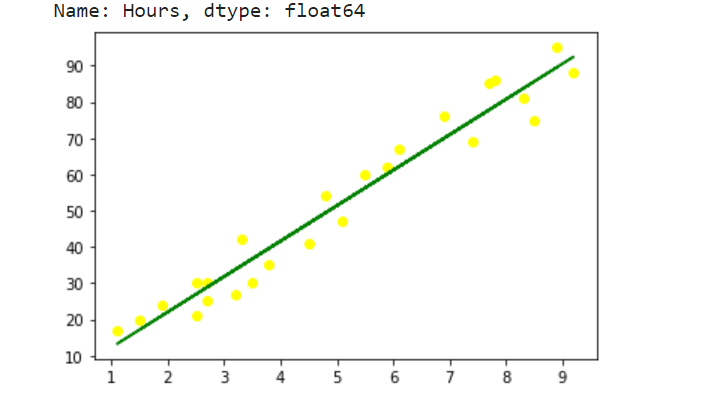

# Implementation-of-Linear-Regression-Using-Gradient-Descent

## AIM:
To write a program to implement the linear regression using gradient descent.

## Equipments Required:
1. Hardware – PCs
2. Anaconda – Python 3.7 Installation / Moodle-Code Runner

## Algorithm
1. Import all the necessary libraries.
2. Introduce the variables needed to execute the function.
3. Using for loop apply the concept using formulae.
4. End the program.

## Program:
```
/*
Program to implement the linear regression using gradient descent.
Developed by: Manoj Guna Sundar Tella.
RegisterNumber:212221240026.
import numpy as np
import pandas as pd
import matplotlib.pyplot as plt
data=pd.read_csv("student_scores - student_scores.csv")
data.head()
data.isnull().sum()
X=data.Hours
X.head()
Y=data.Scores
Y.head()
X_mean=np.mean(X)
Y_mean=np.mean(Y)
n=len(X)
num=0
den=0
Loss=[]
for i in range(len(X)):
    MSE=(1/n)*((Y_mean-Y[i])**2)
    num+=(X[i]-X_mean)*(Y[i]-Y_mean)
    den+=(X[i]-X_mean)**2
    Loss.append(MSE)
m=num/den
c=Y_mean-(m*X_mean)
print (m, c)
Y_pred=(m*X)+c
print (Y_pred)
plt.scatter(X,Y,color='Blue')
plt.plot(X,Y_pred,color='green')
plt.show()
*/

```

## Output:



## Result:
Thus the program to implement the linear regression using gradient descent is written and verified using python programming.
